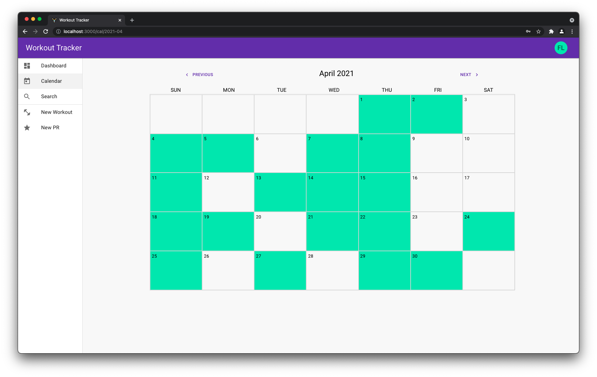
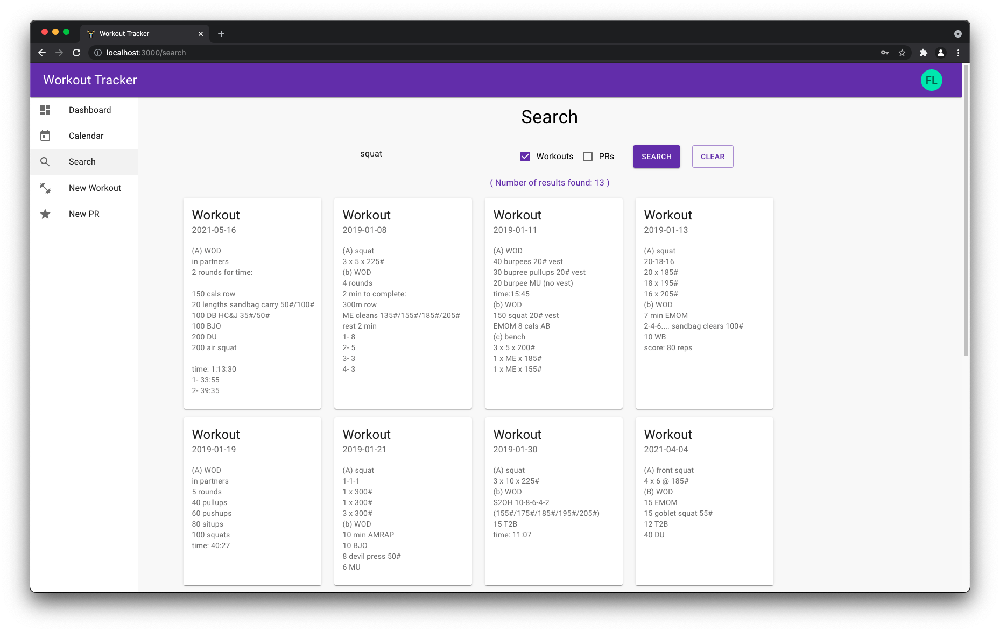
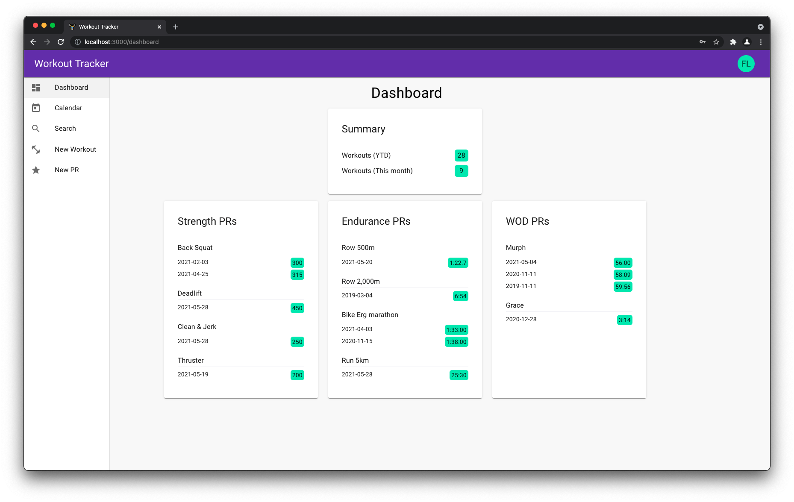
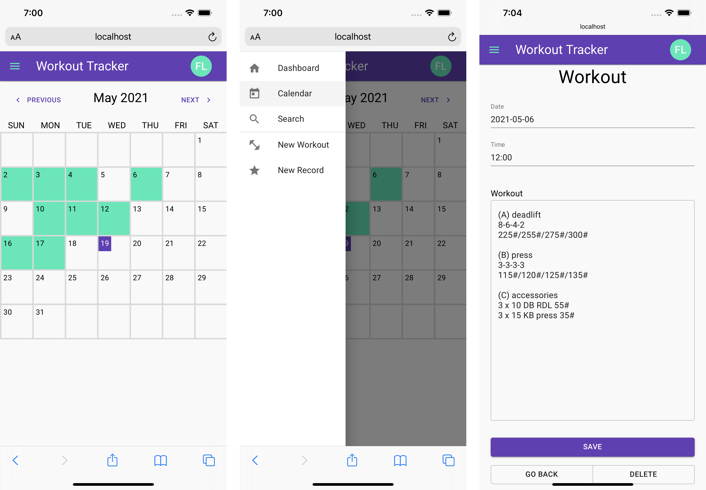

# workout-tracker

This app was built for my partner and I to use everyday to track our workouts, our personal records and to search previous workouts for inspiration or to redo a workout to try and beat our score.

The stack for the app is made up of [Django](https://www.djangoproject.com/) + [Django Rest Framework](https://www.django-rest-framework.org/) for the backend, [PostgreSQL](https://www.postgresql.org/) for the database, [React](https://reactjs.org/) for the frontend framework along with [Material-UI](https://material-ui.com/) for the CSS framework.

### Desktop Screenshot

### Mobile Screenshots

