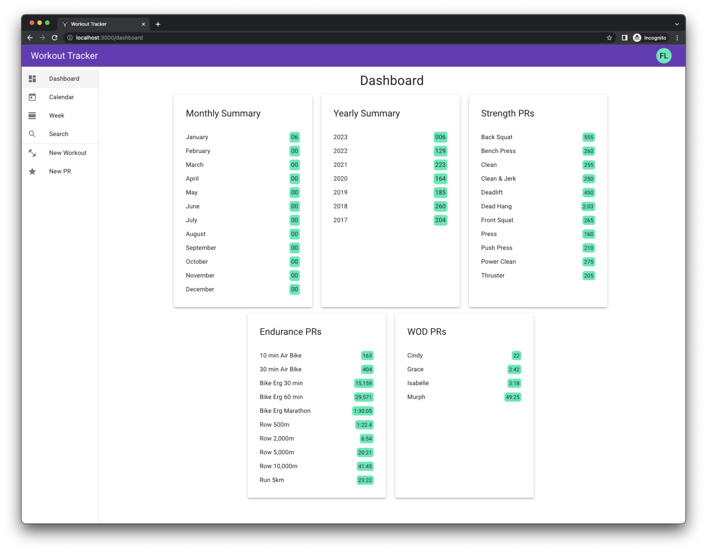
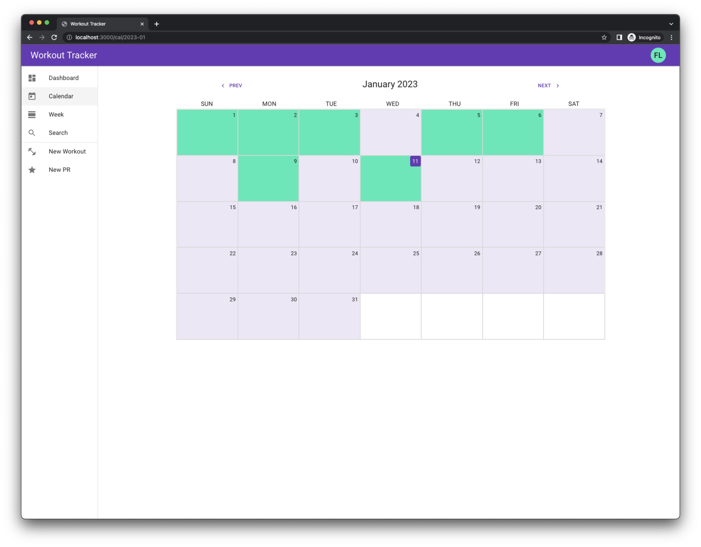
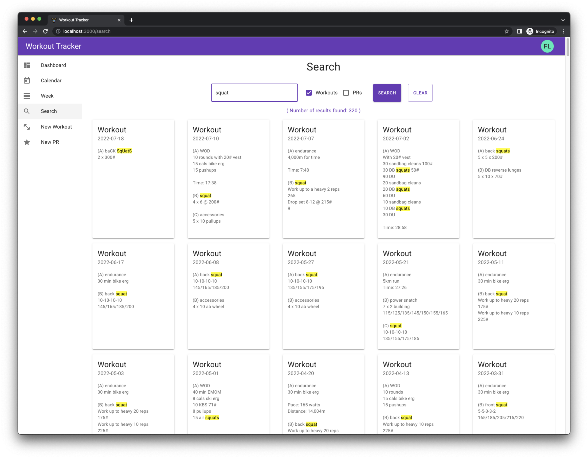
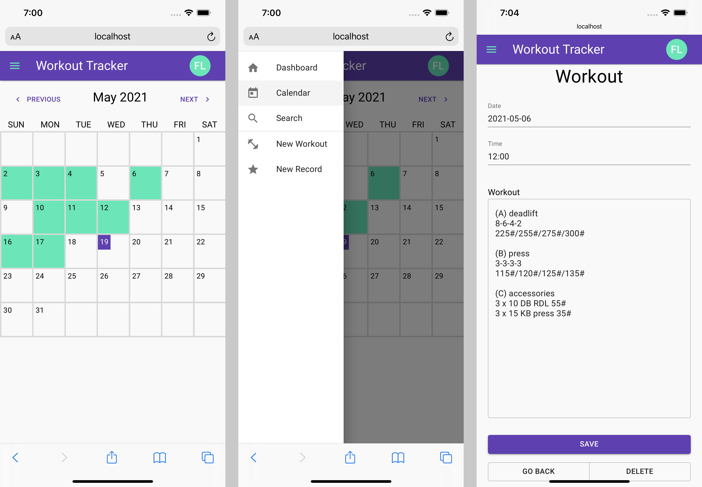
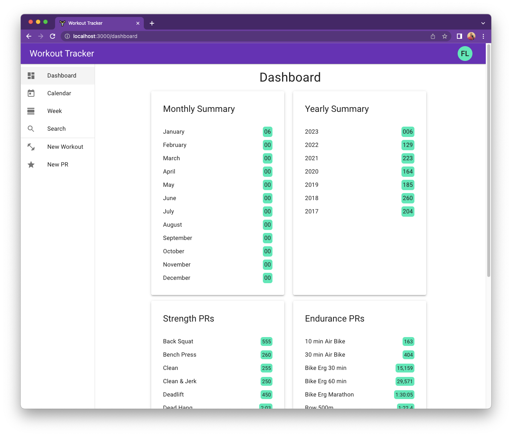
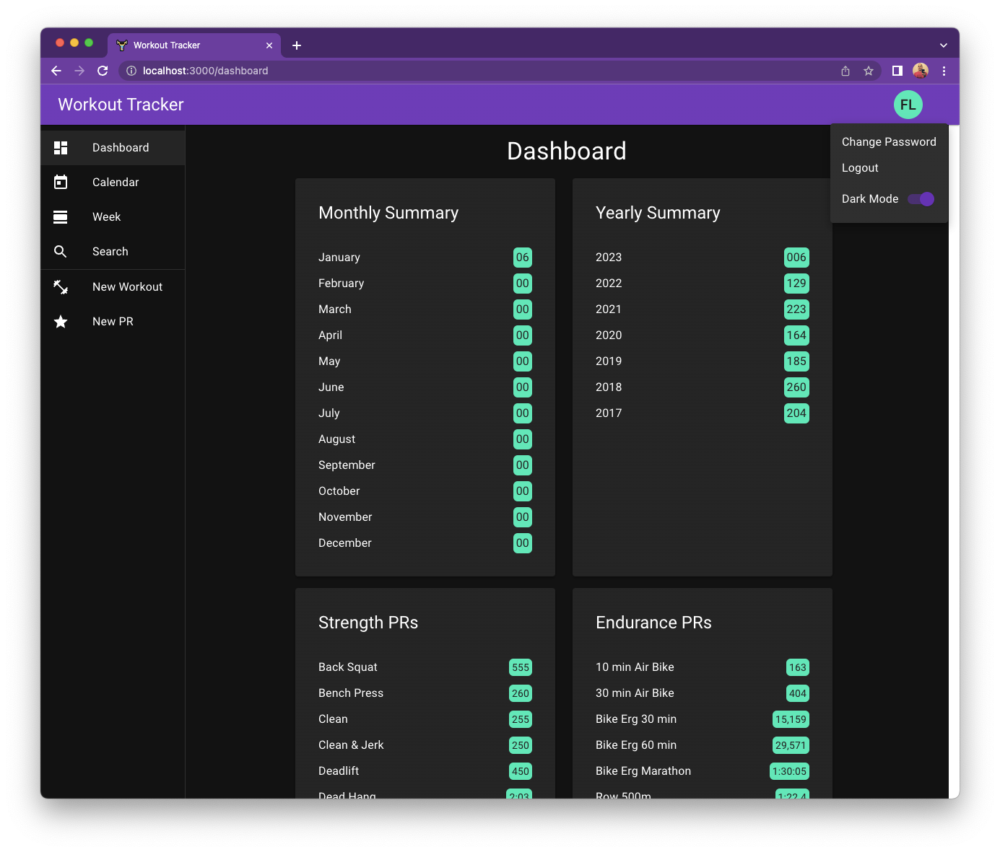

# workout-tracker

This app was built to track workouts and personal records. The application provides information on the number of workouts completed per month and year. There's a calendar view and weekly view to make it easy to review what workouts were done recently, and there's also a search page that enables you to search previous workouts for inspiration or to redo a workout to try and beat our score.

The stack for the app is made up of [Django](https://www.djangoproject.com/) + [Django Rest Framework](https://www.django-rest-framework.org/) for the backend, [PostgreSQL](https://www.postgresql.org/) for the database, [React](https://reactjs.org/) for the frontend framework along with [Material-UI](https://material-ui.com/) for the CSS framework.

### Desktop Screenshot

### Mobile Screenshots

### Dark/Light Theme

    
    

